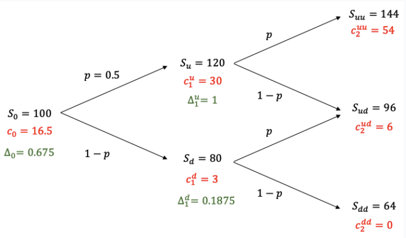

# Delta ($\Delta$) and Delta Hedging

Delta ($\Delta$) measures the change in the price of the option with respect to the change in the price of the underlying asset. 

$$
\begin{aligned}
\Delta_0 = \frac{c_1^u - c_1^d}{S_u - S_d}
\end{aligned}
$$

Finfin
