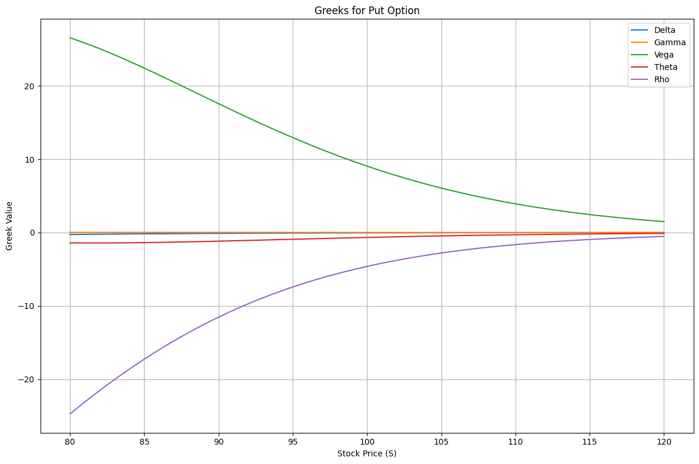

# Ito’s Lemma and Black-Scholes Model

## Stock prices are Log-Normally – Why ?

**Real-world intuition:**

Prices can not go negative. But returns (i.e., the percentage change in price) can. That’s why we assume: 

- Log of the stock price (returns) follows a normal distribution
- So the stock price itself is log-normal 


$$
\ln S_t = \ln S_0 + \left( \mu - \frac{1}{2} \sigma^2 \right)t + \sigma W_t
\Rightarrow S_t = S_0 \cdot e^{\left( \mu - \frac{1}{2} \sigma^2 \right)t + \sigma W_t}
$$


This means:


- $\ln S_t \sim \mathcal{N}(\text{mean}, \text{variance})$
- $S_t \sim \text{Log-Normal}$

## Itô’s Lemma — The Chain Rule for Randomness

If: $dS = \mu S dt + \sigma S dW$ And we want to know how a **function of** S (like \ln S or an option) evolves, we **can’t use normal calculus**. We use **Itô’s Lemma**, which accounts for the “wiggle” of Brownian motion. 

**Itô’s Lemma (1D case)**

Let $f(S, t)$ be a function. If $dS = \mu S dt + \sigma S dW$, then:


$$
df = \frac{\partial f}{\partial t} dt + \frac{\partial f}{\partial S} dS + \frac{1}{2} \frac{\partial^2 f}{\partial S^2} \sigma^2 S^2 dt
$$


**Apply Itô’s Lemma to** $f(S) = \ln S$

If we apply Itô’s Lemma to $\ln S$, we get: 


$$
d(\ln S) = \left( \mu - \frac{1}{2} \sigma^2 \right) dt + \sigma dW
$$


Integrate both sides ⇒ the formula we saw earlier for log-normal stock prices. 

## Black-Sholes Equation

Imagine creating a **risk-free portfolio** by combining:

- A long/short position in the stock
- A derivative (like a call or put)

Apply **no-arbitrage** and risk-neutral logic, you arrive at the **Black-Scholes PDE**:


$$
\frac{\partial f}{\partial t}
	•	rS \frac{\partial f}{\partial S}
	•	\frac{1}{2} \sigma^2 S^2 \frac{\partial^2 f}{\partial S^2}
= rf
$$


## Black-Scholes Formula for Option Prices

### **Call Option:**


$$
c = S_0 N(d_1) - Ke^{-rT} N(d_2)
$$


### **Put Option:**


$$
p = Ke^{-rT} N(-d_2) - S_0 N(-d_1)
$$


Where:


$$
d_1 = \frac{\ln(S_0 / K) + (r + \frac{1}{2} \sigma^2)T}{\sigma \sqrt{T}}, \quad
d_2 = d_1 - \sigma \sqrt{T}
$$


$N(x)$ = cumulative distribution function of standard normal


## Greeks (Sensitivities)

| **Greek** | **Meaning**                   | **Formula (Call)**                                |
| --------- | ----------------------------- | ------------------------------------------------- |
| **Delta** | Sensitivity to price          | $\Delta = N(d_1)$                                 |
| **Gamma** | Sensitivity of Delta to price | $\Gamma = \frac{N{\prime}(d_1)}{S\sigma\sqrt{T}}$ |
| **Vega**  | Sensitivity to volatility     | $\nu = S N{\prime}(d_1) \sqrt{T}$                 |
| **Theta** | Sensitivity to time           | (complex, depends on call/put)                    |
| **Rho**   | Sensitivity to interest rate  | $\rho = K(T) e^{-rT} N(d_2)$                      |


## Python

```python
from wqu.dp import BlackScholes

# Example: A call option
bs = BlackScholes(S0=100, K=100, T=1, r=0.05, sigma=0.2, option_type="call")

print("Option Price:", bs.price())
print("Delta:", bs.delta())
print("Gamma:", bs.gamma())
print("Vega:", bs.vega())
print("Theta:", bs.theta())
print("Rho:", bs.rho())
```

```
Option Price: 10.450583572185565
Delta: 0.6368306511756191
Gamma: 0.018762017345846895
Vega: 37.52403469169379
Theta: -6.414027546438197
Rho: 53.232481545376345
```

or

```python
bs = BlackScholes(S0=100, K=76, T=1, r=0.05, sigma=0.2, option_type="put")
print(bs.to_dict())

bs.plot_greeks(S_range=(80, 120))
```

