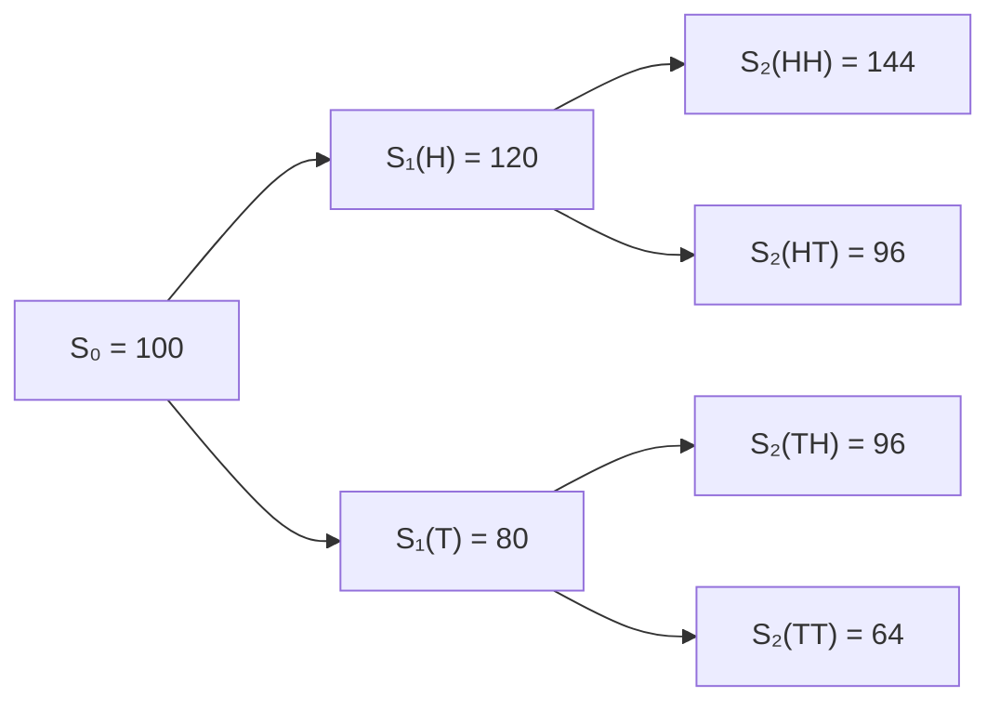

# Binomial Tree for Option Pricing

For the following data: 

```
S0 = 100
T = 1
u = 1.2 
d = 0.8 
N = 2
```

We have:



When using paths, the number of paths in the binomial tree is equal to the $2^N$

Note that in the [Cox-Ross-Rubinstein (CRR) model](https://sci-hub.al/10.1016/0304-405x(79)90015-1) (i.e., NumPy style matrix), we only track distinct price levels, not every path- so it’s much more memory efficient in calculation but loses the intuitive path flavor. 

Which can be implemented as this :

```python

def binomial_tree(S0: float, T: float, u: float, d: float, N: int) -> np.ndarray:
    """
    Constructs a binomial tree of stock prices.

    :param S0: Initial stock price
    :param T: Time to maturity (not used in this basic tree, included for completeness)
    :param u: Up factor per step
    :param d: Down factor per step
    :param N: Number of steps
    :return: 2D array of stock prices [time_step][up_moves]
    """
    S = np.zeros((N + 1, N + 1))

    for j in range(N + 1):      # time step j
        for i in range(j + 1):  # number of up moves i
            S[j, i] = S0 * (u ** i) * (d ** (j - i))

    return S
```

And:	
$$
S[j, i] = S₀ × u^i × d^{(j−i)}
$$


 where:

- j = time step (row)
- i = number of up moves 


