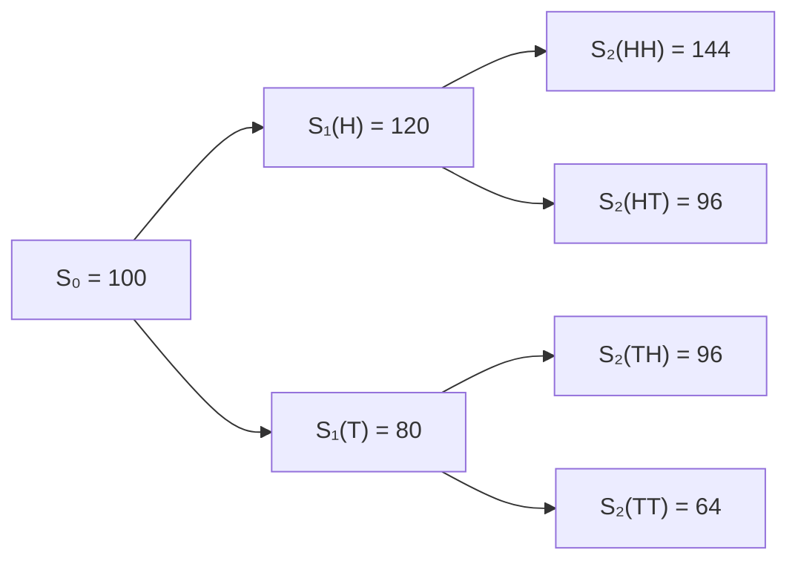

# Binomial Tree for Option Pricing

For the following data: 

```
S0 = 100
T = 1
u = 1.2 
d = 0.8 
N = 2
```

We have:



When using paths, the number of paths in the binomial tree is equal to the $2^N$

Note that in the [Cox-Ross-Rubinstein (CRR) model](https://sci-hub.al/10.1016/0304-405x(79)90015-1) (i.e., NumPy style matrix), we only track distinct price levels, not every path- so it’s much more memory efficient in calculation but loses the intuitive path flavor. 

Which can be implemented as this :

```python
def binomial_tree(initial_price:float, maturity:float, up_factor:float, down_factor:float, steps:int):
    prices = np.zeros((steps + 1, steps + 1))
    for j in range(steps + 1):  # time steps
        for i in range(j + 1):  # up moves
            prices[j, i] = initial_price * (up_factor ** i) * (down_factor ** (j - i))
    return prices
```

And:
$$
S[j, i] = S₀ × u^i × d^{(j−i)}
$$


 where:

- j = time step (row)
- i = number of up moves 


