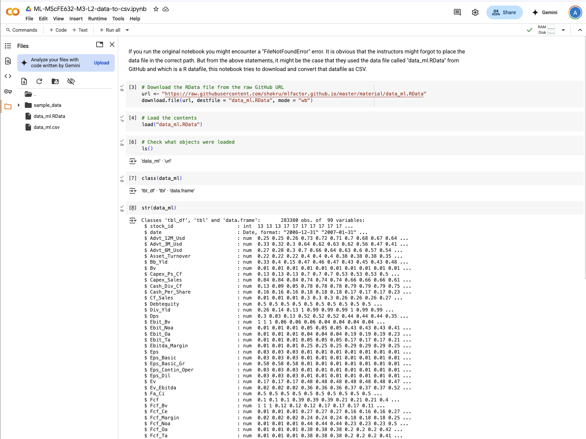

# Other common issues 

## ModuleNotFoundError: No module named 'pca’

Current Python environment dose not have the `pca` PyPI package, we need to install it ( before other cells)

```python
%%capture pca
!pip install pca
```

## ModuleNotFoundError: No module named 'pandas_datareader’

same as above, you need to install this package with:

```python
%%capture pdr
!pip install pandas_datareader
```

## ModuleNotFoundError: No module named 'openpyxl’

```python
%%capture openpyxl
!pip install openpyxl
```

## FileNotFoundError `pd.read_csv("../../data/mlfac_dat.csv")`

This is happening because the environment dose not have the file in the path directed above. We need to download the data file from the GitHub, convert the R datafile into a csv file that Python can handle. 

The Colab notebook below has all the instructions and creates the correct CSV file: 



Link to Colab: https://colab.research.google.com/drive/1HMvdd9LCvYjrWP5Pa2b0fn6HaWSsFcq7?usp=sharing 


## ModuleNotFoundError: No module named 'xgboost’

```python
%%capture xgboost
!pip install xgboost
```

