# Markov Chains

## TL;DR

A Markov Chain is a model where you move between states, and your next move depends only on where you are now. We use a transition matrix to represent the rules, and sometimes the system settles into a long-term distribution called the **stationary distribution**. In finance, this is super useful for modeling **credit rating transitions**, especially with **absorbing states** like default.

## Intro

Imagine a simple board game where you throw a dice 🎲, and depending on the result, you move to a different square. Each square has arrow showing where you might land next - based only on **where you are now**, not how you got there. 

This is the idea of a Markov Chain. 

> A Markov Chain is a system that moves between states, and the next move depdns only on the current state, not the full history.


### Core Concepts with Analogies (Credit Rating)

| **Concept**                 | **Meaning**                                                  | **Analogy**                          |
| --------------------------- | ------------------------------------------------------------ | ------------------------------------ |
| **State**                   | A situation or status (e.g., credit rating AA)               | Square on the board                  |
| **Transition**              | Moving from one state to another                             | Rolling a die and moving forward     |
| **Transition matrix**       | Table showing the probabilities of moving from one state to another | Rules for dice outcomes              |
| **Stationary distribution** | Long-term behavior: how often you land on each state         | Where you’ll spend most of your time |
| **Absorbing state**         | A state that, once entered, you never leave (like default)   | A square that ends the game          |


### Transition Matrix

Let’s say you have $N$ states. The matrix $P$ of transition probabilities looks like this:


$$
P =
\begin{bmatrix}
p_{11} & p_{12} & \cdots & p_{1N} \\
p_{21} & p_{22} & \cdots & p_{2N} \\
\vdots & \vdots & \ddots & \vdots \\
p_{N1} & p_{N2} & \cdots & p_{NN} \\
\end{bmatrix}
$$


And each row must sum to 1:


$$
\sum_{j=1}^{N} p_{ij} = 1 \quad \text{for all } i
$$


### Stationary Distribution

As time goes on, the Markov chain might settle into a pattern where it “spends” time in states according to a fixed distribution $\pi$:


$$
\pi = \pi P
\quad \text{where} \quad \sum_{k=1}^{N} \pi_k = 1, \quad \pi_k \geq 0
$$


This means if you start with $\pi$, applying the matrix dosen’t change it – it’s a fixed point. 

### Estimating Transition Probabilities from Data 

If you observe a lot of transitions, you can build a frequency table. Suppose: 

- $n_{ij}$: number of times we observe a transition from state $i$ to state $j$ 

Then the maximum likelihood estimator is:


$$
\hat{p}{ij} = \frac{n{ij}}{\sum_{k=1}^{N} n_{ik}}
$$


### Absorbing States 

A state is absorbing if: $p_{ii} = 1$, meaning – once you enter it, you stay there. In finance, default is modeled this way. 

### Visualizing a Markov Chain with Credit Ratings


- AAA is the best 
- Default is an absorbing state 
- Arrows show probabilities of moving between ratings 

### Stationary Distribution

Let’s solve for a stationary distribution $\pi$ in a 2-state example: 


$$
P =
\begin{bmatrix}
0.9 & 0.1 \\
0.4 & 0.6
\end{bmatrix} 
$$


We want: 


$$
\pi = [\pi_1, \pi_2], \quad \text{such that} \quad \pi P = \pi
$$


This gives: 


$$
\pi_1 = 0.9 \pi_1 + 0.4 \pi_2 \\
\pi_2 = 0.1 \pi_1 + 0.6 \pi_2 \\
\pi_1 + \pi_2 = 1
$$


Solving the first two yields: 


$$
\pi_1 = \frac{4}{7}, \quad \pi_2 = \frac{3}{7}
$$


## Simplification

### A 2-State Weather Model

Imagine a world where the **only two weather states are**:

- Sunny 🌞 
- Rainy 🌧️

You’d told: 

- If today is **sunny**, there is a **70%** chance tomorrow is sunny, 30% chance it will rain. 
- If today is rainy, there is a 60% chance tomorrow is rainy, a 40% chance it will be sunny. 

```mermaid
graph LR
S[🌞]
R[🌧️]

S-->|0.7|S
S-->|0.3|R

R-->|0.4|S
R-->|0.6|R
```



Let’s say today is sunny. Let’s compute: what’s the probability it will be sunny in 2 days? 

```mermaid
graph LR

S0[🌞] -->|0.7| S1[🌞]-->|0.7| S2[🌞]
S0[🌞] -->|0.3| R1[🌧️]-->|0.4| S3[🌞]
S1[🌞]-->|0.3| R2[🌧️]
R1[🌧️]-->|0.6| R3[🌧️]

```



So we have:

- Sunny in 2 days:
  - 0.7 x 0.7 = 0.49 
  - 0.3 x 0.4 =0.12 
  - in total: 0.49 + 0.12 =0.61 
- Rainy in 2 days:
  - 0.7 x 0.3 =0.21 
  - 0.3 x 0.6 =0.18 
  - in total: 0.21 + 0.18 =0.39 

So: 


$$
P_2(\text{Sunny}) = 0.61, 
P_2(\text{Rainy}) = 0.39
$$


So we can say that we are tracking how a system moves between states over time. And we are **predicting the future** – by using simple rules about the current state. That’s what markov chains are. 

> A method of reasoning about how things change over time, assuming the next step **only depends on the current one**.

This is called the Markov Property.

Let:

- $S_t$: the state at time $t$ 
- $P(S_{t+1} = \text{sunny} \mid S_t = \text{sunny}) = 0.7$
- $P(S_{t+1} = \text{rainy} \mid S_t = \text{sunny}) = 0.3$ 
- Etc.

> You only need to look at today to predict tomorrow – not the whole week’s history. 

### Application: Credit Ratings

Imagine your credit is rated:

- A (great)
- B (okay)
- D (default)

Just like the weather, companies transition between credit levels: 

- A might stay A, or fall to B 
- B might stay B, improve to A, or fall to D 
- D (default) is **absorbing**: once there, you stay 

We can now apply the same simple logic: 

If a company is B today: 

- 50% chance stays B 
- 30% chance to A 
- 20% chance to D 

We now say, if you have: 

- $n$ states 
- The transition from state $i$ to state $j$ has probability $P_{ij}$

Then after two steps: 


$$
\text{Prob(from } i \text{ to } j \text{ in 2 steps)} = \sum_k p_{ik} \cdot p_{kj}
$$


From **state A (i)** to **state C (j)** in **2 moves**. That means: First you go from **A to some intermediate stabe B(k)**, then from **B to C**.

the full path is: $i \rightarrow k \rightarrow j$ , we are just **chaining together two-one-step moves**.  

Let’s say:

- $P_{ik}$: Probability to go from **i to k** in 1 step 
- $P_{kj}$: Probability to go from **k to j** in 1 step 

Then the total probability of the path: $i \rightarrow k \rightarrow j$ is simply: $P_{ik} \cdot P_{kj}$ , you multiply because these two steps are **independent events** happening in sequence. 

If there is’nt just one middle state $k$, there could be multiple: 


$$
\begin{aligned}
i \rightarrow k_1 \rightarrow j \\
i \rightarrow k_2 \rightarrow j \\
i \rightarrow k_3 \rightarrow j \\
\text{etc…}
\end{aligned}
$$


So to find the **total probability** of getting from i to j in exactly 2 steps, you must: **Add up all those possible paths**.

If you have **2 total states** (say, Sunny and Rainy), then the summation over k — the intermediate state — should be: 


$$
\text{Prob(2-step path from } i \text{ to } j) = \sum_{k=1}^{2} P_{ik} \cdot P_{kj} 
$$


Where:


- $i$ is the **starting state**
- $j$ is the **ending state**
- $k$ runs over **all possible intermediate states** (1 and 2 in your case)


If you had 3 states (e.g., A, B, C), then: 


$$
\sum_{k=1}^{3} P_{ik} \cdot P_{kj}
$$


So in general: 


$$
\text{Prob(from } i \text{ to } j \text{ in 2 steps)} = \sum_{k=1}^{n} P_{ik} \cdot P_{kj} 
$$


This formula is scalar-wise computing the (i,j) element of the **squared transition matrix**, **it as a sum of path probabilities**. 

That’s just repeating what we did with sunny/rainy paths! 

We only need a sum of multiplications. 

**What happens over time?** 

If you run this process over and over (like predicting weather every day), you might find that your probability of being in each state **stabilizes**. 

This stable pattern is called the **stationary distribution**


## A matrix wise intuition for Credit Rating As a Markov Chain


This visual makes it clear that:


- A and B can both lead to D (default)
- D loops to itself (absorbing)

Let’s compute the probability that a company starting in **state A** ends up in **D (default)** after **3 years**.

We list all paths from A to D in 3 steps. You can think of this like all 3-move board game paths:

All Possible Paths (A → … → … → D): 

1. **A → A → A → D**:

   $0.8 \times 0.8 \times 0.05 = 0.032$

2. **A → A → B → D**:

   $0.8 \times 0.15 \times 0.2 = 0.024$

3. **A → A → D → D**:

   $0.8 \times 0.05 \times 1 = 0.04$

4. **A → B → B → D**:

   $0.15 \times 0.6 \times 0.2 = 0.018$

5. **A → B → A → D**:

   $0.15 \times 0.2 \times 0.05 = 0.0015$

6. **A → B → D → D**:

   $0.15 \times 0.2 \times 1 = 0.03$

7. **A → D → D → D**:

   $0.05 \times 1 \times 1 = 0.05$

Add them ALL: $P(\text{A→D in 3 steps}) = 0.032 + 0.024 + 0.04 + 0.018 + 0.0015 + 0.03 + 0.05 = \boxed{0.1955}$

### Organize the Probabilities in a Table (From Scalars to Grid)

We already used these scalar transition probabilities: 

| **From / To** | **A** | **B** | **D** |
| ------------- | ----- | ----- | ----- |
| **A**         | 0.80  | 0.15  | 0.05  |
| **B**         | 0.20  | 0.60  | 0.20  |
| **D**         | 0.00  | 0.00  | 1.00  |

This is now a **transition table** — a 2D grid. 

### Turn That Table Into a Transition Matrix P

Now let’s write the same thing using math notation: 


$$
P =
\begin{bmatrix}
0.80 & 0.15 & 0.05 \\
0.20 & 0.60 & 0.20 \\
0.00 & 0.00 & 1.00 \\
\end{bmatrix}
$$


Each row tells you: **from this state**, what are the chances of going to all other states. 

### One-Step Probability as a Matrix Dot Product

Let’s say a company is currently **in state A**.

We represent that as a **vector**:


$$
\textbf{v}_0 = [1, 0, 0] \quad \text{(100\% in A, 0\% in B or D)}
$$


To find the probabilities **after 1 year**, you multiply:


$$
\textbf{v}_1 = \textbf{v}_0 \cdot P 
$$

$$
\textbf{v}_1 = [1, 0, 0] \cdot
\begin{bmatrix}
0.80 & 0.15 & 0.05 \\
0.20 & 0.60 & 0.20 \\
0.00 & 0.00 & 1.00 \\
\end{bmatrix}
= [0.80, 0.15, 0.05]
$$


That means:


- 80% chance in A
- 15% chance in B
- 5% chance in D

Same as the table. 

### Now Try 2 Years — Multiply Again

To get the probabilities after 2 steps: 


$$
\textbf{v}_2 = \textbf{v}_1 \cdot P
= [0.80, 0.15, 0.05] \cdot P
$$


We’re now doing exactly what you did in scalar logic — computing all the 2-step paths — but doing it much faster with matrix multiplication. 

### General Rule

$$
\textbf{v}{t} = \textbf{v}{t-1} \cdot P
\quad \text{or} \quad
\textbf{v}_t = \textbf{v}_0 \cdot P^t
$$


You’re simulating **how the distribution of ratings evolves** over time. 

So: 


$$
\begin{aligned}
\textbf{v}_1 = \textbf{v}_0 \cdot P \\
\textbf{v}_t = \textbf{v}_0 \cdot P^t
\end{aligned}
$$

## Summarization

> A Markov Chain is like walking through a series of states (like credit ratings, weather, or game levels) where **the only thing that matters for your next move is where you are right now** — not how you got there.

That’s called the **Markov property**: 


$$
P(S_{t+1} = s{\prime} \mid S_t = s, S_{t-1}, …, S_0) = P(S_{t+1} = s{\prime} \mid S_t = s)
$$


Only the **current state** matters for predicting the next one. That means,  imagine your credit rating today is B. Whether you got downgraded from A or upgraded from C last year doesn’t matter. All that matters is you are B now — the next step is based on that. 

> RL is about learning how to act in a sequence of situations to get the best long-term reward.

At time t:

- **State**: $s_t \in \mathcal{S}$
- **Action**: $a_t \in \mathcal{A}$
- **Reward**: $r_t \in \mathcal{R}$
- **Next State**: $s_{t+1} \in \mathcal{S}$

Goal: Find the best sequence of actions: $\{a_0, a_1, \ldots, a_t, \ldots\}$

That **maximizes cumulative reward** over time. This is the **big picture** — and Markov chains are the engine beneath the hood. 

### A 2-State Homogeneous Markov Chain

- **States**: $\mathcal{S} = \{s_1, s_2\}$, where $s_1 < s_2$
- **Transition Probabilities**:
  - $\mathbb{P}(S_{t+1} = s_1 | S_t = s_1) = p$ 
  - $\mathbb{P}(S_{t+1} = s_2 | S_t = s_2) = q$ 

The matrix is:


$$
P = \begin{bmatrix}
p & 1 - p \\
1 - q & q
\end{bmatrix}
$$


If each state is associated with a numerical value (e.g., $s_1 = -1, s_2 = 1$), then multiplying the transition matrix P by the state vector S gives us the **expected value** of the next state. 


## Code

The main code is written within the `sm/markov.py`

```python
class StateMarkovChain:
    def __init__(self, states, transition_matrix, initial_state=None):
```

where: 

```python
self.states = np.array(states)
self.P = np.array(transition_matrix)
self.N = len(states)
```

- states: a list like [-1, 1] or [0, 1, 2] — these are the **actual values** of the states $s_1, s_2, \dots$ 
- P: the **transition matrix** $P \in \mathbb{R}^{N \times N}$, where $P_{ij} = \mathbb{P}(s_{t+1} = j \mid s_t = i)$ 

```python
assert self.P.shape == (self.N, self.N)
assert np.allclose(self.P.sum(axis=1), 1)
```

- Ensures the matrix is square and each row sums to 1 (valid probability transition matrix)

```python
self.index_map = {state: i for i, state in enumerate(self.states)}
self.current_state = initial_state if initial_state else np.random.choice(self.states)
```

- index_map allows converting from state values (e.g., -1, 1) to matrix indices
- current_state: initialized to a given or random state


