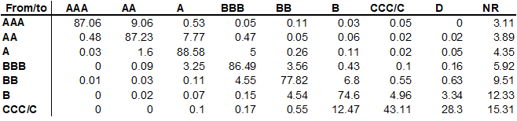
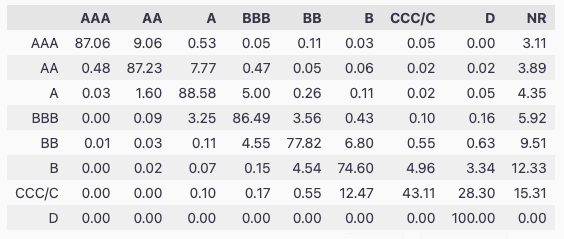
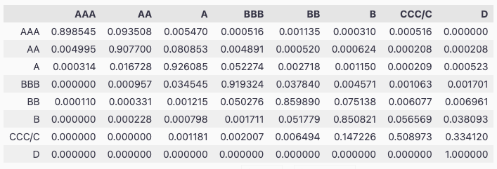
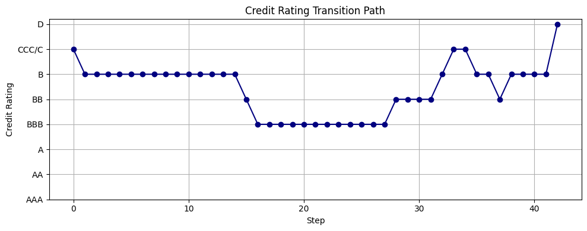
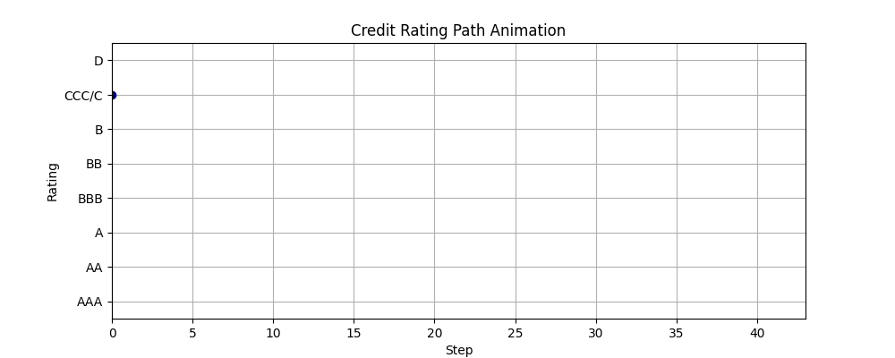

# Credit Ranking Markov Chain Example



The table above shows the actual transition probabilities for credit ratings published by Standard & Poor's (𝑁𝑅NR stands for "rating withdrawn"). And our objective is to model the transition probabilities for credit ratings using a Markov chain.

## Step 1: Define the states

```python
# Final code
import pandas as pd

raw_matrix_with_nr = np.array([
    [87.06, 9.06, 0.53, 0.05, 0.11, 0.03, 0.05, 0.0, 3.11],
    [0.48, 87.23, 7.77, 0.47, 0.05, 0.06, 0.02, 0.02, 3.89],
    [0.03, 1.6, 88.58, 5.0, 0.26, 0.11, 0.02, 0.05, 4.35],
    [0, 0.09, 3.25, 86.49, 3.56, 0.43, 0.1, 0.16, 5.92],
    [0.01, 0.03, 0.11, 4.55, 77.82, 6.8, 0.55, 0.63, 9.51],
    [0.0, 0.02, 0.07, 0.15, 4.54, 74.6, 4.96, 3.34, 12.33],
    [0.0, 0.0, 0.1, 0.17, 0.55, 12.47, 43.11, 28.3, 15.31],
    [0.0, 0.0, 0.0, 0.0, 0.0, 0.0, 0.0, 100.0, 0.0],
])

raw_state_labels_with_nr = ["AAA", "AA", "A", "BBB", "BB", "B", "CCC/C", "D", "NR"]
pd.DataFrame(raw_matrix_with_nr, columns=raw_state_labels_with_nr, index=raw_state_labels_with_nr[:-1])
```
Which results in the following matrix:



## Step 2: Normalize the matrix

```python
# Drop the NR column and normalize each row so it sums to 1
normalized_matrix = raw_matrix_with_nr[:, :-1]
normalized_matrix = normalized_matrix / normalized_matrix.sum(axis=1, keepdims=True)
# Check normalization
row_sums = normalized_matrix.sum(axis=1)
row_sums
```
resulting the following output:

```
array([1., 1., 1., 1., 1., 1., 1., 1.])
```
which confirms that the matrix is normalized.

## Step 3: Create the Markov chain

```python
from wqu.sm.credit_rating import CreditRatingMarkovChain

# Use standard credit rating labels
S = ["AAA", "AA", "A", "BBB", "BB", "B", "CCC/C", "D"]
# Transition matrix without NR
P = normalized_matrix
# Initialize the Markov chain
crm = CreditRatingMarkovChain(states=S, transition_matrix=P, initial_state="CCC/C")

# Check the transition matrix (with Pandas DataFrame to make it look nicer)
pd.DataFrame(crm.P, columns=S, index=S)
```



## Step 4: Simulate

```python
# Simulate a single path
crm.simulate_path(steps=100)
# Plot the path
crm.plot_path()
```



```python
# We can also animate the path
crm.animate_path()
```



```
# you can also check the full Graph like this:
crm.graphviz_chain()
```

```python
# Simulate multiple paths and calculate the default rate
crm.simulate_multiple_paths(steps=100, num_simulations=1000)
```

```
{'simulations': 1000, 'defaulted': 954, 'default_rate': 0.954}
```


```python
# Get the 10th, 200th power of the transition matrix
P10 = crm.get_matrix_power(10)
P200 = crm.get_matrix_power(200)
```


```python
crm.simulate_histories(num_paths=1000, num_steps=100)
crm.average_time_to_default()
```

```
8.332988624612202
```


